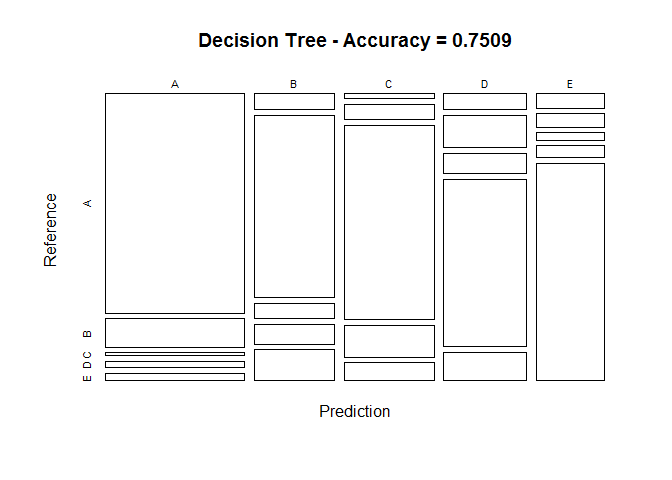
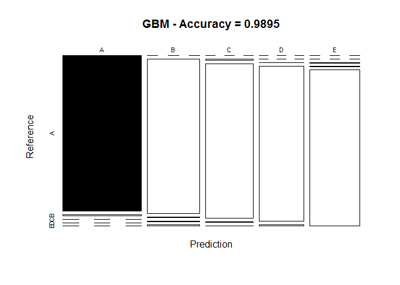

# Practical Machine Learning Course Project
fbalhorn  
21 August 2016  


## Prediction Assignment Writeup

### Overview
This document is the final report of the Peer Assessment project from Coursera’s course Practical Machine Learning. The main goal of the project is to predict the manner in which 6 participants performed some exercise as described below. This is the “classe” variable in the training set. The machine learning algorithm described here is applied to the 20 test cases available in the test data and the predictions are submitted in appropriate format to the Course Project Prediction Quiz for automated grading.

### Further information
Using devices such as Jawbone Up, Nike FuelBand, and Fitbit it is now possible to collect a large amount of data about personal activity relatively inexpensively. These type of devices are part of the quantified self movement - a group of enthusiasts who take measurements about themselves regularly to improve their health, to find patterns in their behavior, or because they are tech geeks. One thing that people regularly do is quantify how much of a particular activity they do, but they rarely quantify how well they do it. In this project, your goal will be to use data from accelerometers on the belt, forearm, arm, and dumbell of 6 participants. They were asked to perform barbell lifts correctly and incorrectly in 5 different ways. More information is available from the website here: [http://groupware.les.inf.puc-rio.br/har](http://groupware.les.inf.puc-rio.br/har) (see the section on the Weight Lifting Exercise Dataset).

### Data

The training data for this project are available here:

[https://d396qusza40orc.cloudfront.net/predmachlearn/pml-training.csv](https://d396qusza40orc.cloudfront.net/predmachlearn/pml-training.csv)

The test data are available here:

[https://d396qusza40orc.cloudfront.net/predmachlearn/pml-testing.csv](https://d396qusza40orc.cloudfront.net/predmachlearn/pml-testing.csv)

# Analysis
## Preparation of Environment

We first upload the R libraries that are necessary for the complete analysis.


```
## Loading required package: lattice
```

```
## Loading required package: ggplot2
```

```
## Rattle: Ein kostenloses grafisches Interface für Data Mining mit R.
## Version 4.1.0 Copyright (c) 2006-2015 Togaware Pty Ltd.
## Geben Sie 'rattle()' ein, um Ihre Daten mischen.
```

```
## randomForest 4.6-12
```

```
## Type rfNews() to see new features/changes/bug fixes.
```

```
## 
## Attaching package: 'randomForest'
```

```
## The following object is masked from 'package:ggplot2':
## 
##     margin
```

## Load and Clean the data

You can also embed plots, for example:


```r
# set the URL for the download
UrlTrain <- "http://d396qusza40orc.cloudfront.net/predmachlearn/pml-training.csv"
UrlTest  <- "http://d396qusza40orc.cloudfront.net/predmachlearn/pml-testing.csv"

# download the datasets
training <- read.csv(url(UrlTrain))
testing  <- read.csv(url(UrlTest))

# create a partition with the training dataset 
inTrain  <- createDataPartition(training$classe, p=0.7, list=FALSE)
TrainSet <- training[inTrain, ]
TestSet  <- training[-inTrain, ]
dim(TrainSet)
```

```
## [1] 13737   160
```

Both created datasets have 160 variables. Those variables have plenty of NA, that can be removed with the cleaning procedures below. The Near Zero variance (NZV) variables are also removed and the ID variables as well.


```r
NZV <- nearZeroVar(TrainSet)
TrainSet <- TrainSet[, -NZV]
TestSet  <- TestSet[, -NZV]
dim(TrainSet)
```

```
## [1] 13737   107
```

```r
dim(TestSet)
```

```
## [1] 5885  107
```

```r
# remove variables that are mostly NA
AllNA    <- sapply(TrainSet, function(x) mean(is.na(x))) > 0.95
TrainSet <- TrainSet[, AllNA==FALSE]
TestSet  <- TestSet[, AllNA==FALSE]
dim(TrainSet)
```

```
## [1] 13737    59
```

```r
dim(TestSet)
```

```
## [1] 5885   59
```

```r
# remove identification only variables (columns 1 to 5)
TrainSet <- TrainSet[, -(1:5)]
TestSet  <- TestSet[, -(1:5)]
dim(TrainSet)
```

```
## [1] 13737    54
```

```r
dim(TestSet)
```

```
## [1] 5885   54
```

After the cleaning, we yield a reduced dataset of only 54 variables.
### Correlation Analysis
A correlation among variables is analysed before proceeding to the modeling procedures.

```r
corMatrix <- cor(TrainSet[, -54])
corrplot(corMatrix, order = "FPC", method = "color", type = "lower", 
         tl.cex = 0.8, tl.col = rgb(0, 0, 0))
```

<!-- -->

The highly correlated variables are shown in dark colors in the graph above. To make an evem more compact analysis, a PCA (Principal Components Analysis) could be performed as pre-processing step to the datasets. Nevertheless, as the correlations are quite few, this step will not be applied for this assignment.

# Building a Prediction Model

Three methods will be applied to model the regressions (in the Train dataset) and the best one (with higher accuracy when applied to the Test dataset) will be used for the quiz predictions. The methods are: Random Forests, Decision Tree and Generalized Boosted Model, as described below.
A Confusion Matrix is plotted at the end of each analysis to better visualize the accuracy of the models.

A Confusion Matrix is plotted at the end of each analysis to better visualize the accuracy of the models.

## 1.: Random Forest

```r
# model fit
set.seed(9876)
controlRF <- trainControl(method="cv", number=3, verboseIter=FALSE)
modFitRandForest <- train(classe ~ ., data=TrainSet,method="rf",trControl=controlRF)
modFitRandForest$finalModel
```

```
## 
## Call:
##  randomForest(x = x, y = y, mtry = param$mtry) 
##                Type of random forest: classification
##                      Number of trees: 500
## No. of variables tried at each split: 27
## 
##         OOB estimate of  error rate: 0.19%
## Confusion matrix:
##      A    B    C    D    E  class.error
## A 3905    0    0    0    1 0.0002560164
## B    6 2650    1    1    0 0.0030097818
## C    0    5 2391    0    0 0.0020868114
## D    0    0    7 2245    0 0.0031083481
## E    0    2    0    3 2520 0.0019801980
```

```r
# prediction on Test dataset
predictRandForest <- predict(modFitRandForest, newdata=TestSet)
confMatRandForest <- confusionMatrix(predictRandForest, TestSet$classe)
confMatRandForest
```

```
## Confusion Matrix and Statistics
## 
##           Reference
## Prediction    A    B    C    D    E
##          A 1674    4    0    0    0
##          B    0 1131    1    0    0
##          C    0    4 1025    1    0
##          D    0    0    0  962    1
##          E    0    0    0    1 1081
## 
## Overall Statistics
##                                           
##                Accuracy : 0.998           
##                  95% CI : (0.9964, 0.9989)
##     No Information Rate : 0.2845          
##     P-Value [Acc > NIR] : < 2.2e-16       
##                                           
##                   Kappa : 0.9974          
##  Mcnemar's Test P-Value : NA              
## 
## Statistics by Class:
## 
##                      Class: A Class: B Class: C Class: D Class: E
## Sensitivity            1.0000   0.9930   0.9990   0.9979   0.9991
## Specificity            0.9991   0.9998   0.9990   0.9998   0.9998
## Pos Pred Value         0.9976   0.9991   0.9951   0.9990   0.9991
## Neg Pred Value         1.0000   0.9983   0.9998   0.9996   0.9998
## Prevalence             0.2845   0.1935   0.1743   0.1638   0.1839
## Detection Rate         0.2845   0.1922   0.1742   0.1635   0.1837
## Detection Prevalence   0.2851   0.1924   0.1750   0.1636   0.1839
## Balanced Accuracy      0.9995   0.9964   0.9990   0.9989   0.9994
```

```r
# plot matrix results
plot(confMatRandForest$table, col = confMatRandForest$byClass, 
     main = paste("Random Forest - Accuracy =",
                  round(confMatRandForest$overall['Accuracy'], 4)))
```

<!-- -->

## 2.: Decision Trees

```r
# model fit
set.seed(9876)
modFitDecTree <- rpart(classe ~ ., data=TrainSet, method="class")
# fancyRpartPlot(modFitDecTree)
# prediction on Test dataset
predictDecTree <- predict(modFitDecTree, newdata=TestSet, type="class")
confMatDecTree <- confusionMatrix(predictDecTree, TestSet$classe)
confMatDecTree
```

```
## Confusion Matrix and Statistics
## 
##           Reference
## Prediction    A    B    C    D    E
##          A 1482  190   19   43   50
##          B   62  709   60   77  121
##          C   21   67  841  138   78
##          D   62  129   82  668  114
##          E   47   44   24   38  719
## 
## Overall Statistics
##                                           
##                Accuracy : 0.7509          
##                  95% CI : (0.7396, 0.7619)
##     No Information Rate : 0.2845          
##     P-Value [Acc > NIR] : < 2.2e-16       
##                                           
##                   Kappa : 0.6844          
##  Mcnemar's Test P-Value : < 2.2e-16       
## 
## Statistics by Class:
## 
##                      Class: A Class: B Class: C Class: D Class: E
## Sensitivity            0.8853   0.6225   0.8197   0.6929   0.6645
## Specificity            0.9283   0.9326   0.9374   0.9214   0.9681
## Pos Pred Value         0.8307   0.6890   0.7345   0.6332   0.8245
## Neg Pred Value         0.9532   0.9114   0.9610   0.9387   0.9276
## Prevalence             0.2845   0.1935   0.1743   0.1638   0.1839
## Detection Rate         0.2518   0.1205   0.1429   0.1135   0.1222
## Detection Prevalence   0.3031   0.1749   0.1946   0.1793   0.1482
## Balanced Accuracy      0.9068   0.7775   0.8786   0.8072   0.8163
```

```r
# plot matrix results
plot(confMatDecTree$table, col = confMatDecTree$byClass, 
     main = paste("Decision Tree - Accuracy =",
                  round(confMatDecTree$overall['Accuracy'], 4)))
```

<!-- -->

## 3.: Gradient Boosted Model

```r
# model fit
set.seed(9876)
controlGBM <- trainControl(method = "repeatedcv", number = 5, repeats = 1)
modFitGBM  <- train(classe ~ ., data=TrainSet, method = "gbm",
                    trControl = controlGBM, verbose = FALSE)
```

```
## Loading required package: gbm
```

```
## Loading required package: survival
```

```
## 
## Attaching package: 'survival'
```

```
## The following object is masked from 'package:caret':
## 
##     cluster
```

```
## Loading required package: splines
```

```
## Loading required package: parallel
```

```
## Loaded gbm 2.1.1
```

```
## Loading required package: plyr
```

```r
modFitGBM$finalModel
```

```
## A gradient boosted model with multinomial loss function.
## 150 iterations were performed.
## There were 53 predictors of which 40 had non-zero influence.
```

```r
# prediction on Test dataset
predictGBM <- predict(modFitGBM, newdata=TestSet)
confMatGBM <- confusionMatrix(predictGBM, TestSet$classe)
confMatGBM
```

```
## Confusion Matrix and Statistics
## 
##           Reference
## Prediction    A    B    C    D    E
##          A 1674   15    0    0    0
##          B    0 1115    3    4    9
##          C    0    9 1018    7    1
##          D    0    0    2  952    8
##          E    0    0    3    1 1064
## 
## Overall Statistics
##                                           
##                Accuracy : 0.9895          
##                  95% CI : (0.9865, 0.9919)
##     No Information Rate : 0.2845          
##     P-Value [Acc > NIR] : < 2.2e-16       
##                                           
##                   Kappa : 0.9867          
##  Mcnemar's Test P-Value : NA              
## 
## Statistics by Class:
## 
##                      Class: A Class: B Class: C Class: D Class: E
## Sensitivity            1.0000   0.9789   0.9922   0.9876   0.9834
## Specificity            0.9964   0.9966   0.9965   0.9980   0.9992
## Pos Pred Value         0.9911   0.9859   0.9836   0.9896   0.9963
## Neg Pred Value         1.0000   0.9950   0.9984   0.9976   0.9963
## Prevalence             0.2845   0.1935   0.1743   0.1638   0.1839
## Detection Rate         0.2845   0.1895   0.1730   0.1618   0.1808
## Detection Prevalence   0.2870   0.1922   0.1759   0.1635   0.1815
## Balanced Accuracy      0.9982   0.9878   0.9944   0.9928   0.9913
```

```r
# plot matrix results
plot(confMatGBM$table, col = confMatGBM$byClass, 
     main = paste("GBM - Accuracy =", round(confMatGBM$overall['Accuracy'], 4)))
```

<!-- -->

# Applying the Most Accurate Model to the Data
The accuracy of the 3 regression modeling methods above are:

*Random Forest : 0.9980
*Decision Tree : 0.7509
*GBM : 0.9895

In that case, the Random Forest model will be applied to predict the 20 quiz results (testing dataset) as shown below.


```r
predictTEST <- predict(modFitRandForest, newdata=testing)
predictTEST
```

```
##  [1] B A B A A E D B A A B C B A E E A B B B
## Levels: A B C D E
```

